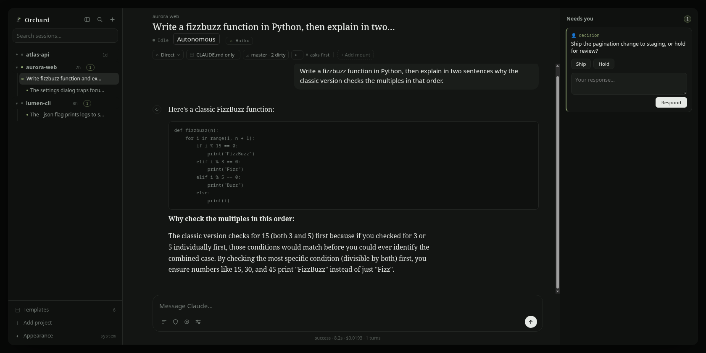
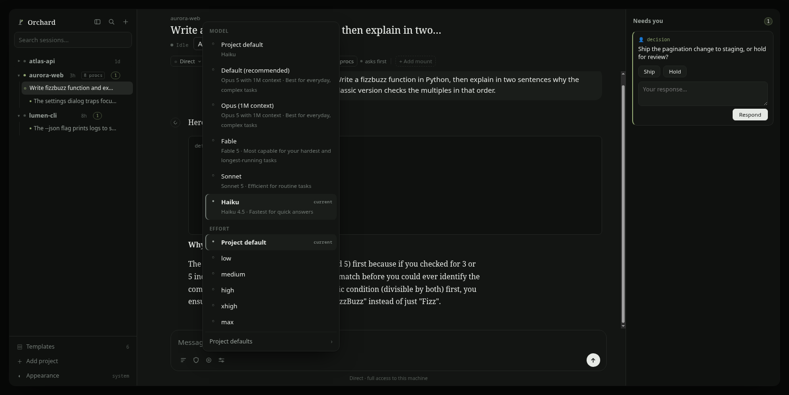
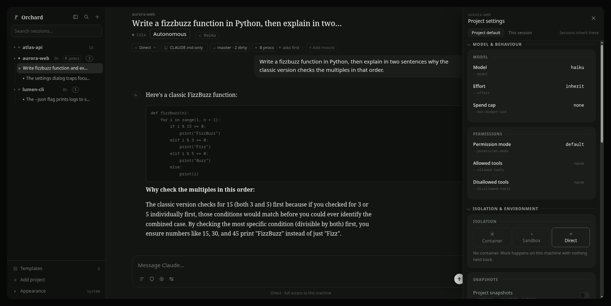

# Orchard

A local, single-user dashboard for running AI coding sessions across all your projects at once,
on a subscription you already have.



## Why it exists

**You end up explaining how to work, over and over.** Orchard composes one instruction bundle per
project (working agreement, conventions, routing, reply format), roughly 36,000 characters on
this repository, so editing it changes every project instead of one.

**Watching many sessions should not mean many terminal windows.** The sidebar lists projects and
sessions; the main pane renders the transcript instead of emulating a terminal, and anything
needing an answer collects in one rail on the right.

**Isolation is one control, not a Dockerfile.** Switch a project from host to Docker container
in its settings; the first run builds an image locally (~1 GB, Docker required), after which
sessions run capped on memory with dropped capabilities.

**Everyday git work stays in the app.** A git panel with four views: changes, branches, history,
stashes. It is deliberately narrow, no discard, merge, rebase or per-hunk staging, and history
and stashes are read-only.

**Written-down work survives a session ending.** Adding a project scaffolds a ticket board under
`docs/bugs/`, an append-only file per ticket, injected as a snapshot into every session's prompt
there. Uncheck "apply the Orchard method" to skip it.

**Long replies get shorter without you asking.** A hook nudges a session's final reply when it
drifts from a short digest format. It is advisory and switchable off per project.

## Quick start

**Platform: Linux, or Windows via WSL2.** The core shells out to Unix commands with no
portable fallback — `git`, `rg` (ripgrep, for session search), and `cp --reflink=always`
(for snapshots). Optional extras need more: systemd for the background service and restart
survival, Docker for container isolation. On native Windows the server boots but these
features fail one by one without saying why; run it under WSL2 (with `systemd=true` in
`/etc/wsl.conf` for the background service) instead. macOS is untested.

```sh
npm install                       # first time only
npm start                         # -> http://127.0.0.1:4317
```

Node 23 or newer runs the TypeScript directly, no build step. `PORT` and `CLAUDE_STATION_DATA`
override the defaults; data (registry, templates, snapshots) lives under your XDG data
directory, outside the repository.

To run it as a background app, copy `deploy/claude-station.service` into your systemd user unit
directory, fix the repository path inside it, then `systemctl --user enable --now claude-station`.

**The old name.** Orchard used to be called Claude Station; anything naming *stored state* keeps
the old name so renaming it would not orphan existing data:

- the systemd unit
- the `CLAUDE_STATION_*` environment variables
- the `~/.local/share/claude-station` data directory
- the Docker image and container labels

**Providers.** Claude Code (Anthropic Pro/Max, `claude` on `PATH`, signed in) or OpenAI Codex
(ChatGPT Plus and up, `codex login`, meaning "Sign in with ChatGPT", not an API key). Orchard
never reads or stores API keys for either. Details in [docs/PROVIDERS.md](docs/PROVIDERS.md).

New to it? [docs/guide/](docs/guide/README.md) walks through the workflow with screenshots.

## What it does

- **Sessions with a queue.** Type while a turn is running; messages queue and deliver in order,
  or force-send.
- **Subagent visibility.** Spawned agents render as live rows and always settle (completed,
  failed or cut) instead of spinning forever.
- **Multi-provider.** Pick the provider at launch; a header chip shows the model the session
  actually reported.
- **A rail for anything that needs you.** A running session raises a question as a card on the
  rail, without you hunting for its session.
- **Restart survival.** The server can restart while sessions keep running; live turns are
  drained and re-adopted.
- **Headless dispatch.** `scripts/dispatch.mjs` runs a one-shot task through either provider and
  prints the result. `scripts/gatekeeper.mjs` reviews a commit range from a fresh context on the
  *other* provider.
- **Honest state.** Provider errors relay their real cause; unimplemented things fail loudly.
- **Instruction templates.** Markdown with frontmatter, composed per project, with a preview
  endpoint.
- **Project snapshots.** Per-session undo via reflink copies on btrfs, near-instant, close to
  zero extra bytes until files diverge, with a loud failure if reflink is unavailable.



Per-project settings (model, permission mode, isolation, snapshots, integrations) live in a
drawer, with a "this session" scope for a single run.



## Optional integrations

Per-project toggles. None of these are bundled.

- **serena.** Symbol-level code navigation over a language server, run via `uvx`
  ([github.com/oraios/serena](https://github.com/oraios/serena)).
- **playwright.** `@playwright/mcp` via `npx`, an ephemeral headless browser with a clean profile.
- **A persistent browser profile.** Keeps its profile between sessions for sites you stay signed
  into. It is a separate local project, not published here; point `CLAUDE_STATION_SBMCP_REPO` at
  it, or the toggle degrades with a clear message — the session still starts, without the browser
  tools, and says why. Set it where the server actually starts (a systemd unit drop-in, not a
  shell): exported into a session manager's environment it disappears on the next reboot.

## Security posture

Single-user, local-only tooling.

- **Localhost-only binding.** The server binds `127.0.0.1` and has no auth tier of its own
  (out of scope, see Status). Do not port-forward it or put it behind a reverse proxy.
- **Browser and DNS-rebinding boundary.** A browser's same-origin policy does not gate WebSocket
  *establishment*, so another origin, including via DNS rebinding, could otherwise open a socket
  to the local port. The WebSocket upgrade enforces an origin allowlist and both HTTP and
  WebSocket enforce a host allowlist, both extendable via `CLAUDE_STATION_ALLOWED_ORIGINS` and
  `CLAUDE_STATION_ALLOWED_HOSTS`.
- **Permission modes.** Sessions run with Claude Code's normal permission gate. Skipping
  approvals is an explicit per-project or per-session choice, never a global default, and is
  flagged as a raised risk outside a container.
- **Isolation tiers.** `direct` (the default, on the host), `container` (Docker, with resource
  limits on by default), and `sandbox` (bubblewrap), which is designed but **not implemented**
  and returns an error rather than silently degrading.
- **Docker socket.** Mounting it into a container is off by default and takes two deliberate
  clicks: on a rootful daemon it is equivalent to root on the host.
- **Dispatch runner.** Defaults to a read-only sandbox with approvals set to never; in-workspace
  writes are opt-in. On the Anthropic path this is policy enforcement, not a kernel sandbox.
- **Credentials.** No API keys are read or stored; sessions use the provider CLI's own sign-in.

## Verify

```sh
npm run typecheck                # tsc --noEmit
node scripts/verify.ts --offline # API + agent bridge, no model calls
node scripts/verify-ui.ts        # drives the real UI in a real DOM against a real server
npm run verify                   # the full end-to-end pass (calls the model, costs tokens)
npm run gate                     # the pre-commit gate
```

Every harness spawns a real server on a scratch data directory and a free port, prints what it
observed, and kills what it started.

## Layout

| Path | Purpose |
| --- | --- |
| `src/server/index.ts` | HTTP and WebSocket server, JSON API, static UI |
| `src/server/agent-bridge.ts` | Wraps the provider runtimes; normalises messages into one event type |
| `src/server/events.ts` | The typed event union, the only contract between bridge and UI |
| `src/server/runtime/` | Provider runtimes (Claude Code, Codex) behind one interface |
| `src/server/registry.ts` | JSON project registry, atomic writes, project scan |
| `src/server/git.ts` | The git panel's server side |
| `src/server/snapshots.ts` | Per-session project snapshots via reflink, and restore |
| `public/` | The UI (vanilla JavaScript, no framework, no bundler) |
| `scripts/` | Verification harnesses, dispatch runner, gatekeeper, onboarding, gates |
| `docs/guide/` | The user guide, also served inside the app |

## Status

A personal project, developed in the open and moving quickly, built for one person on one
machine. Interfaces change without deprecation periods; `docs/bugs/` is the honest record of
what works and what does not.

Deliberately out of scope: an auth tier, multiple users, a file manager, a preview proxy,
API-key authentication.

## Licence

Orchard is released under the [PolyForm Noncommercial License 1.0.0](LICENSE)
(`PolyForm-Noncommercial-1.0.0`).

**You may** use, modify and share it for any noncommercial purpose: personal projects, study,
research, hobby work, and use by charities, schools, public research bodies and government
institutions.

**You may not** use it commercially without a separate licence, arranged with the copyright
holder, not granted by this file. Ask by opening an issue on this repository. There is no
licensing email address, deliberately.
