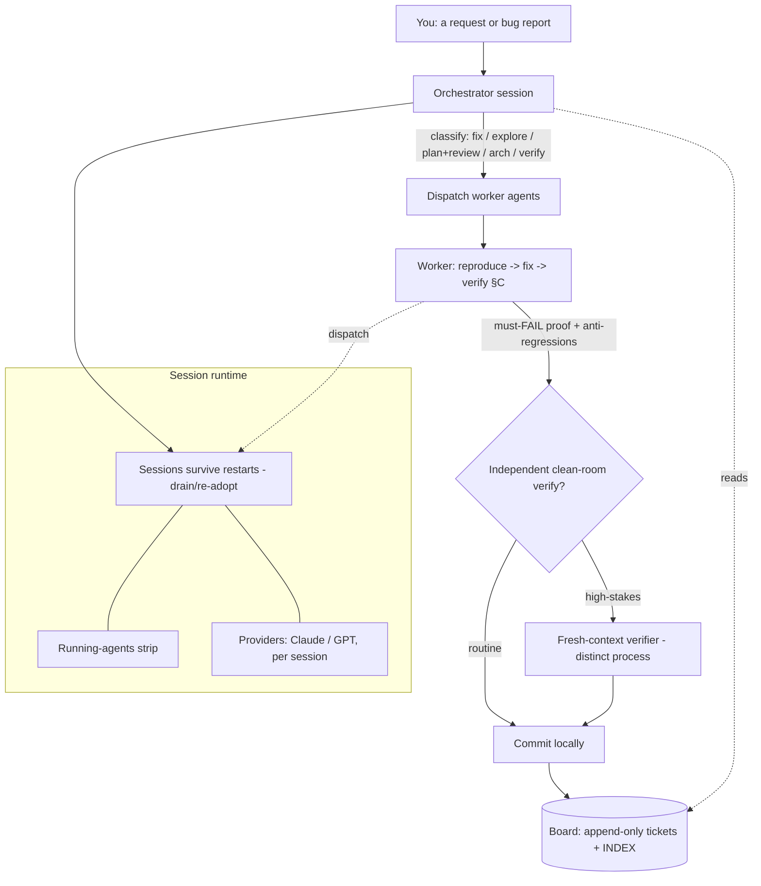

# Orchard — Guide

Orchard is a local, single-user dashboard (systemd user service on `127.0.0.1:4317`) for running and
**orchestrating** AI coding sessions across your projects. This guide explains both the internal
**workflow** (much of which runs invisibly) and the user-facing **features** — so a new or returning
user can understand what runs, when, why, and how to change it.

> **Accuracy & freshness.** Every section is derived from the actual code, not invented. Each page
> declares the source files it describes (frontmatter `sources:`), and `npm run docs:fresh` flags a
> page as possibly-stale when a source's git blob hash changes since the page was last blessed —
> so the guide self-reports drift instead of silently rotting. See
> [FEAT-075](../bugs/FEAT-075-guide-docs-system.md).

*This guide also lives **in the app**: the Guide pill in the topbar opens it from
anywhere, with the same pages and diagrams rendered offline (synthetic data).*

> Screenshots throughout the guide are captured over **synthetic placeholder
> data** (fictional projects, generic tickets) and refreshed by re-running
> `npm run docs:screenshots` — so they update when the UI moves rather than
> quietly going stale.

## How it fits together

## Workflow (how the system works)
- **[Architecture & rationale](architecture.md)** — the system-level map: every subsystem (service &
  survival, the runtime seam, history/transcripts, injection, wiring, isolation, board, verification),
  what each provides, and why it's built that way — each point anchored to the real code.
- **[Orchestration & dispatch](orchestration.md)** — the orchestrator-doesn't-implement model, the
  dispatch classes (trivial / fix / explore / plan+review / arch / verify), agent types, the
  model-tier rule.
- **[Verification & the ticket flow](verification.md)** — §C must-FAIL proofs, the **independent
  clean-room verifier** (yes — a *distinct* fresh context, not the solver), the verify→fix loop, the
  self-correcting board, and the 2026-08-13 hardening (realistic-state fixtures + the concurrency
  gate).
- **[The Working Agreement & self-maintenance](working-agreement.md)** — how the WA is injected into
  sessions (→ CLAUDE.md), the canonical repo + mirror, and **consolidation** (what triggers it, what
  it does, how you steer it).

## Features (what you can do)
- **[Integrations: browser, Serena, providers](integrations.md)** — browser for **UI testing** vs
  the **stealth** browser for net-browsing, the Serena LSP tier, and the mixed Claude+GPT provider
  fleet.
- **[Projects, sessions & isolation](projects-and-sessions.md)** — onboarding a new project (is
  orchestration applied by default? — no, `npm run onboard` is the deliberate step), isolation tiers
  (direct / sandbox / container), permission modes, session survival across restarts, the
  running-agents list, scratch sessions, and per-session provider / `/model` switching.

## Conventions this guide documents
- **Verification realism** — a fix's suite must include a realistic busy-state fixture, not just the
  minimal case (see verification.md).
- **Concurrency gate** — one in-place writer per file; simultaneous same-file work uses git worktrees.
- **High-stakes → independent verify** — security / lifecycle / data-loss changes get a fresh-context
  skeptic pass, not just self-verification.
- **Regression honesty** — a fix that repairs a prior fix's miss records `regressed-from: TICKET`.
