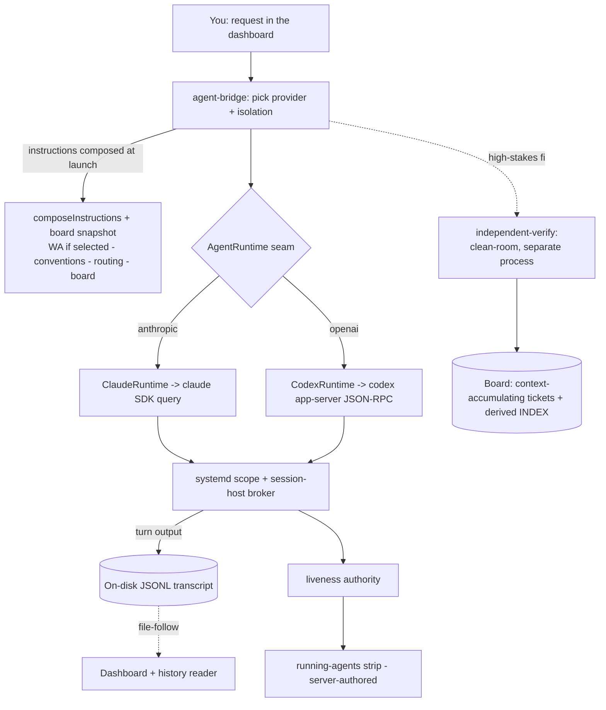

---
sources:
  - deploy/claude-station.service
  - src/server/survival.ts
  - src/server/session-host.mjs
  - src/server/liveness.ts
  - src/server/running-set.ts
  - src/server/survivor-delivery.ts
  - src/server/runtime/runtime.ts
  - src/server/runtime/claude-runtime.ts
  - src/server/runtime/codex-runtime.ts
  - src/server/agent-bridge.ts
  - src/lib/session-history.ts
  - src/server/orchard-transcripts.ts
  - src/server/codex-native.ts
  - src/server/templates.ts
  - src/server/wiring.ts
  - scripts/onboard.mjs
  - src/server/container-manager.ts
  - src/server/board.ts
  - src/server/tickets.ts
  - scripts/board.mjs
  - scripts/independent-verify.mjs
  - scripts/lib/verdict-contract.mjs
  - scripts/gatekeeper.mjs
  - scripts/check-docs-fresh.mjs
---
# Architecture & rationale

This page is the system-level map: what Orchard is, the subsystems it is built from, and — for
each — *what it provides* and *why it is built that way*. It is a companion to the workflow pages
([orchestration](orchestration.md), [verification](verification.md),
[projects & sessions](projects-and-sessions.md)); those explain how you use the system, this
explains how the parts fit and why.

> **Every claim here is meant to be a direct statement about the real code, grounded in the
> `sources:` listed above.** That grounding has a precise, honest limit: like every guide page,
> this one declares its `sources:` and is flagged possibly-stale by `npm run docs:fresh` when a
> described file's git blob hash changes since the page was last blessed
> (`scripts/check-docs-fresh.mjs`) — so it self-reports *when a source file moves*. It does **not**
> prove the prose is semantically correct, that the stated rationale still holds, or that nothing
> load-bearing was omitted; a blob-hash tripwire catches drift, not wrong framing. Treat a fresh
> blessing as "the cited files have not changed", not "every sentence is verified true". Where the
> *rationale* (not the code) is the durable record, this page links the decision ticket rather than
> restating it.
>
> *In-app rendering note:* the current Guide viewer renders headings, prose, lists, code and the
> flow diagram, but not GFM tables or `[text](url)` links (that is [FEAT-081]; until it lands the
> table below shows as pipe-delimited text and links as their literal path). Nothing critical is
> reachable *only* through the table or a link — the per-subsystem prose sections below fully
> restate what the table summarises, and every linked ticket's path is visible in the link text.

## What Orchard is (the short version)

- **A local, single-user dashboard for running and orchestrating AI coding sessions.** It ships as a
  systemd *user* service bound to loopback `127.0.0.1:4317` (`deploy/claude-station.service`); it is
  not a hosted product and reads no API keys — sessions bill against your existing Claude / Codex
  subscription.
- **It runs the vendor CLIs, it does not reimplement them.** A Claude session drives the
  `@anthropic-ai/claude-agent-sdk` `query()` object; a Codex session drives the `codex app-server`
  over JSON-RPC. Both sit behind one `AgentRuntime` seam (`src/server/runtime/runtime.ts`), so the
  rest of the app never imports a vendor SDK type.
- **Eligible sessions outlive the server process.** A qualifying session's CLI is launched into its
  own systemd scope and fronted by a small broker, so restarting or crashing the dashboard does not
  kill an in-flight turn or its background agents (`src/server/survival.ts`,
  `src/server/session-host.mjs`). This is a *gated* capability, not a universal one: survival is
  armed only for `direct` sessions whose engine persists its own transcript and where survival is
  enabled (`survivalEnabled() && capabilities.persistedTranscript`, `agent-bridge.ts:791`). Codex
  sessions, container sessions, and survival-disabled sessions are closed normally on shutdown
  (`agent-bridge.ts:2811`).
- **History is on disk, append-only, and auditable.** Claude sessions use the CLI's own JSONL store;
  Codex and other non-persisting engines get an Orchard-owned transcript in the *same* layout, so
  one set of readers serves every provider (`src/lib/session-history.ts`,
  `src/server/orchard-transcripts.ts`).
- **Discipline is opt-in and decoupled from the runtime.** Adding a project gives you the tools; the
  methodology (Working Agreement, conventions, ticket board) is injected/scaffolded only when you
  ask for it (`src/server/wiring.ts`, `scripts/onboard.mjs`). A project can run with Orchard's tools
  and none of its discipline — that split is deliberate.
- **A fix is not confirmed by whoever wrote it.** High-stakes changes are re-verified by a
  fresh-context, clean-room agent in a *separate process* whose evidence must cite runs a harness
  recorded — the author's own green checkmark does not count
  (`scripts/independent-verify.mjs`, `scripts/lib/verdict-contract.mjs`).

Why this is useful: the failure modes Orchard spends its complexity on are the ones that make
multi-agent coding on your own machine untrustworthy — a restart silently killing background work, a
surface claiming "nothing running" while a turn executes, a provider swap you didn't notice, and a
fix that only its own author ever checked. Each is addressed by a named mechanism below, not a
convention.

## Subsystem map

| Subsystem | What it provides | Why built this way / target it achieves |
|---|---|---|
| **Service & port** (`deploy/claude-station.service`) | A systemd *user* unit on `127.0.0.1:4317`, `Restart=on-failure`. | Local single-user tool; loopback-only so it is not network-exposed. The unit runs at systemd's default `KillMode=control-group` — the fact the survival layer is designed against. |
| **Survival broker** (`survival.ts`, `session-host.mjs`) | For *eligible* sessions (`direct` + engine-persisted transcript + survival enabled): the CLI runs in its own systemd scope, fronted by a stdio broker, and survives a server restart/crash. | A `systemctl restart` SIGTERMs the whole service cgroup; escaping into a transient scope keeps the CLI + its background agents alive. Target: a restart must never kill or truncate an *eligible* in-flight turn. Gated (`agent-bridge.ts:791`) — Codex, container, and survival-off sessions do not qualify. |
| **Liveness authority** (`liveness.ts`, `running-set.ts`) | One module that answers "is X alive / mid-turn"; the running-agents strip is a server-authored snapshot. | ARCH-001: many call sites each re-deciding liveness disagreed. One authority, three-valued (alive/dead/**unknown**), never coerced. Target: no surface says "nothing running" while a turn executes. |
| **Runtime seam** (`runtime.ts`, `claude-runtime.ts`, `codex-runtime.ts`) | A single `AgentRuntime` interface; per-provider adapters; a declared `RuntimeCapabilities` set (mostly Boolean flags plus a two-valued `backgroundLifetime`). | Keeps vendor SDKs out of the rest of the app; lets the UI gray out features an engine lacks instead of faking parity. |
| **Provider selection** (`agent-bridge.ts`, `registry.ts`) | Per-project provider (`anthropic`/`openai`), per-session `/model` override. On resume, the transcript's own engine overrides the configured provider. | The configured provider is used as-is — there is no decorrelation applied to ordinary sessions here (cross-provider is a *verification* default, not a session-routing rule; see below). On resume the transcript's engine wins because a session id only means something to the engine that minted it. |
| **History & transcripts** (`session-history.ts`, `orchard-transcripts.ts`, `codex-native.ts`) | On-disk JSONL history for every session; append-only Orchard mirror for non-persisting engines; on-demand import of native Codex sessions. | Mirroring the Claude store layout means one reader set serves all providers unchanged. Append-only = auditable, restart-durable. |
| **Instruction injection** (`templates.ts`, composed at `agent-bridge.ts:534-549`) | An ordered, in-memory system-prompt stack composed at each launch: enabled instruction-template refs → non-empty `docs/CONVENTIONS.md` → routing mirror → live board snapshot. The Working Agreement is present only if an enabled WA template ref is selected. | Injection writes nothing into your repo; a selected Working Agreement template is read-through from the live file, not a stored copy — edit canonical, it propagates. A project with `instructions:[]` gets conventions + routing + board but no WA. |
| **Wiring & onboarding** (`wiring.ts`, `onboard.mjs`) | A per-project methodology-health panel (live, never cached) + an idempotent scaffolder. | FEAT-076: runtime and methodology are decoupled; a status that can go stale can lie, so it is derived from source every render. Onboarding is a deliberate, byte-for-byte-idempotent opt-in. |
| **Isolation** (`container-manager.ts`, `container/`) | Three tiers: `direct` (host), `container` (hardened Docker), `sandbox` (modelled, returns 501). | Container isolates the machine, not the project tree (it is bind-mounted rw). A container failure must propagate, never silently degrade to host execution. |
| **Board & tickets** (`board.ts`, `tickets.ts`, `board.mjs`) | Context-accumulating `docs/bugs/` tickets + a derived `INDEX.md` board; an in-app rail. | Tickets are the source of truth; the board is re-derived each `gen`, so a done ticket can't leave a "still in progress" row drifting. Ticket bodies accumulate history, while lifecycle ops (create/reopen) do narrow, revision-guarded in-place status/section edits (`tickets.ts:566`); `INDEX.md` is fully rewritten. |
| **Verification discipline** (`independent-verify.mjs`, `verdict-contract.mjs`, `gatekeeper.mjs`) | A clean-room fresh-context verifier + an executed-evidence verdict contract + a pre-push gatekeeper. | Generation must not be its own only verifier: verification runs in a distinct process (enforced), cross-provider by default (overridable), and evidence is bound to harness-recorded runs an agent cannot forge. |
| **Docs freshness** (`check-docs-fresh.mjs`) | Per-page `sources:` frontmatter pinned to git blob hashes; a WARN when a source moves. | A confidently-stale doc is worse than none; content-addressed pins make a guide page self-report drift. |

## How a request flows

---

## Service, survival & liveness

### The service and the kill it is built against
The dashboard is a systemd **user** unit (`deploy/claude-station.service`): `Type=simple`, one
`node src/server/index.ts`, `Environment=PORT=4317`, `Restart=on-failure`. The unit declares no
`KillMode`, so it runs at systemd's default `KillMode=control-group` — a `systemctl restart` sends
SIGTERM to the entire service cgroup, which includes every child CLI and in-process sub-agent unless
a process has escaped that cgroup. That single fact is what the survival subsystem exists to handle
(`src/server/survival.ts` header; `src/server/session-host.mjs` header).

### Two survival axes
- **Process survival (cgroup escape).** A `direct` session's CLI is not left as a plain child of the
  server. `spawnSurvivable()` launches it via `systemd-run --user --scope --collect
  --unit=claude-station-host-<key>`, landing the broker + CLI in a *separate* transient scope under
  `app.slice`, so the service's control-group kill never reaches it
  (`src/server/survival.ts:228-232`). It is gated on `systemd-run --user` + `XDG_RUNTIME_DIR` being
  available, with `CLAUDE_STATION_SURVIVE=0` as a kill-switch.
- **Transport survival (the broker).** `session-host.mjs` is a small out-of-process stdio broker
  that owns the CLI's pipes instead of the server. It *always drains* the CLI's stdout so a turn
  never blocks on a full pipe even with no client attached, and it *keeps stdin open* — a client
  (socket) disconnect is deliberately **not** forwarded as stdin EOF
  (`src/server/session-host.mjs:405-411`). So a dead or restarting server does not end the CLI's
  turn; killing the SDK's transport handle only disconnects the socket.

### Re-adoption and its honest boundary
On boot, `adoptSurvivingHosts()` scans the hosts dir and gracefully reaps each survivor: SIGTERM →
the broker holds stdin-EOF until the current turn's `result` lands → the CLI writes its final
transcript → broker exits (`src/server/survival.ts:519-538`). The residual limitation is stated in
the code, not hidden: a restarted server *cannot* inject a new turn into the still-running CLI,
because the Agent SDK's `query({resume})` always spawns a fresh CLI. Survival guarantees no in-flight
work is killed or orphaned; the thread then continues by the normal resume-from-disk path. A
matching guard (`survivingHostForSdkSession()`) refuses a second `claude --resume` onto a transcript
a survivor is still draining, so there is never a double-writer.

### One liveness authority (ARCH-001)
`src/server/liveness.ts` is the single module every server-side decision consults for "is X alive /
mid-turn"; a conformance test (`scripts/verify-liveness-conformance.mjs`) enforces that nothing
re-derives it locally. It separates three answers deliberately: `state` (ground truth, three-valued
including **unknown**, never coerced), `running` (the claim a turn is in flight), and `live` (what
callers act on). Ordering is ground-truth-first, timer-last: a dead process short-circuits, a
verified-alive CLI is live *regardless of silence* and is never reaped by the frameless-window timer
(`FRAMELESS_MS`, default 600 s). The running-agents strip is a server-authored snapshot
(`running-set.ts`), gated on the authority — an empty `running` array is itself a load-bearing answer
that corrects a stale client without a reload.

This is a durable architectural decision; the full rationale (and the eight+ tickets that motivated
it) is in [ARCH-001](../bugs/ARCH-001-single-liveness-authority.md).

### Delivering into a survivor
`survivor-delivery.ts` (FEAT-065) writes a single stream-json `user` frame into a drain-held
survivor's still-open stdin over its broker socket, running a normal turn in the *same CLI pid* — so
a post-restart session can accept a message while its broker holds the drain for live background
work. It relays permission prompts to the dashboard's approval card and bounds the wait, and refuses
a second concurrent delivery for the same session (single writer).

### The lifetime invariant (ARCH-002)
Background work that outlives the turn that started it must not be reaped. The broker's drain-commit
and abandon paths consult a three-valued `backgroundOutlivesTurn()` (yes / **unknown** / no); yes or
unknown holds the drain — `unknown` is never coerced to `no`. This is the second architectural
decision record: [ARCH-002](../bugs/ARCH-002-turn-scoped-vs-work-scoped.md) — *every unit of work
carries a declared lifetime; no component may infer it*, and an advisory surface must not silently
become control flow.

## The runtime seam & providers

`AgentRuntime` (`src/server/runtime/runtime.ts:238-276`) is the one seam between Orchard and the
model-execution engine; nothing above it references a vendor SDK type. A runtime provides `start` /
`send` / `interrupt` / `setPermissionMode` / `setModel` (live switch, streaming-only) /
`supportedModels` / `messages()` (an async-iterable of engine-native frames) / `detach` / `close`,
plus an optional provider-error classifier. Parity is *declared, not faked*: `RuntimeCapabilities`
(`runtime.ts:26-75`) carries the Boolean flags `approvals`, `permissionModes`, `structuredCost`,
`modelList`, `subagents`, `persistedTranscript`, `fork`, `effort`, `planMode`, `mcpConfig`, plus a
**two-valued** `backgroundLifetime: 'reported' | 'absent'` — declaring only whether the engine
reports its background-work lifetime, *not* the lifetime itself. (The three-valued
yes/no/**unknown** judgement is the separate `WorkLifetime.outlivesTurn` answer derived at runtime,
`runtime.ts:87-90` — capability metadata and the resulting lifetime verdict are deliberately
distinct.) The UI grays out what an engine lacks.

- **ClaudeRuntime** is the only file above `session-mutations.ts` that imports the Agent SDK. It
  builds SDK `Options` and drives `query()`; multi-turn input is a hand-rolled queue; `detach()` is a
  no-op because the `claude` CLI persists its own `.jsonl` store. It is the reference adapter: all of
  its Boolean capability flags are `true` and its `backgroundLifetime` is `'reported'`
  (`src/server/runtime/claude-runtime.ts:120-135`).
- **CodexRuntime** is a peer adapter: it spawns `codex app-server` and speaks JSON-RPC 2.0 over
  newline-delimited stdio (`thread/start`, `turn/start`, `turn/interrupt`, `model/list`), translating
  app-server notifications into the Claude-shaped frames the bridge already consumes
  (`src/server/runtime/codex-runtime.ts`). Its capability differences are concrete and honest:
  `structuredCost:false` (subscription billing reports tokens, not USD, so a dollar cap is
  unenforceable), `persistedTranscript:false`, `planMode:false`, `mcpConfig:false`,
  `backgroundLifetime:'absent'`; model/permission changes apply from the *next* `turn/start`, not
  mid-turn.

Provider is stored **per project** (`Provider = 'anthropic' | 'openai'`, default `anthropic`) and the
concrete runtime is chosen once, at session construction in `agent-bridge.ts:647-693` — before
isolation routing, which reads the runtime's capabilities. Ordinary dashboard sessions run the
*configured* provider as-is; `agent-bridge` applies **no** cross-provider decorrelation to normal
sessions (that is a verification-time policy, covered under the clean-room verifier below, not a
session-routing rule). One invariant worth calling out: **on resume the transcript's engine overrides
the configured provider** (`agent-bridge.ts:657-679`), and the override is announced rather than
applied silently, because a session id is only meaningful to the engine that minted it.

## History & transcripts

- **Claude native store.** `src/lib/session-history.ts` reads the CLI's own layout —
  `<root>/<encodedDir>/<sessionId>.jsonl`, one JSONL file per session, `root` defaulting to
  `$CLAUDE_PROJECTS_DIR` or `~/.claude/projects`. Reads are bounded, never whole-file (a
  head+tail sample for metadata; chunked streaming with a forward budget for messages), because real
  transcripts reach hundreds of MB.
- **Orchard-owned mirror.** Engines whose `persistedTranscript` capability is false (Codex) don't
  write Claude's store, so `orchard-transcripts.ts` writes an Orchard transcript in the *same entry
  shape and layout* under its own root (`dataDir()/transcripts/<provider>/<encodedDir>/<sessionId>.jsonl`).
  Every write is a single append (`fs.appendFileSync`) — never a truncate or rewrite — so history is
  append-only and restart-durable, and because the layout matches, existing readers work unchanged.
  The one acknowledged gap is stated in the code: output produced after server death mid-turn is not
  captured, which is why survival stays gated off for non-persisting engines.
- **Native Codex ingestion (FEAT-078).** Sessions made with the plain `codex` CLI live in Codex's own
  date-keyed store and were invisible. `codex-native.ts` handles them in two deliberately-split
  phases: a cheap head-only *listing* pass that matches a rollout's `session_meta.cwd` to the project,
  and an on-demand *import* that full-parses a rollout and translates each item into the Orchard entry
  shape — after which it is a normal Orchard-owned Codex session for every downstream reader (history,
  live-detection, resume, fork) with no new lifecycle code. Import is idempotent and race-safe
  (temp-file + rename; an existing target is left for a possibly-live resume).

## Instruction injection

Instructions are composed **at the real launch site**, not only in a preview route. The `AgentSession`
constructor calls `composeInstructions(refs, { hostPath, routing: true })`
(`src/server/agent-bridge.ts:534-549`), then appends the live board snapshot and any extra content via
`appendToSystemPrompt` (`agent-bridge.ts:853-855`), and passes the result as the runtime's
`systemPrompt` (`agent-bridge.ts:909-926`), which `ClaudeRuntime` forwards to the SDK's
`Options.systemPrompt`. The composed stack builds an in-memory system prompt — **it writes nothing
into your repo.** The order is load-bearing (`templates.ts:466-494`, stated at `:480-482`): (1) the
refs-derived Working Agreement templates, (2) the project-local `docs/CONVENTIONS.md` folded on if
present and non-empty, (3) the provider-routing section folded last; the board snapshot is then
appended by the launch site.

The Working Agreement is **conditional, not automatic**: `composeInstructions` only loads *configured
template refs* (`templates.ts:426-433`), so the WA is in the stack **only when an enabled WA template
ref is selected**. A project with `instructions:[]` still gets conventions + routing + board, but no
WA. This is distinct from a repo's `CLAUDE.md` Working-Agreement *pointer*, which is ambient,
provider-specific project instruction the CLI reads on its own — Orchard does **not** resolve or
compose a `CLAUDE.md` pointer into the system prompt, and it is not provider-neutral. When a WA
template *is* selected it is **read-through**: templates carry a `source:` path resolved from the live
repo file at read time, not a stored copy, so editing the canonical WA propagates without a re-seed.
The last `replace`-mode template supersedes everything above it; otherwise sections are appended to
the `claude_code` preset.

## Wiring & onboarding

Runtime access and methodology are decoupled (FEAT-076): adding a project gives it Orchard's tools,
but the methodology reaches a session through **four distinct mechanisms**, not one — worth keeping
separate:

- **A selected WA template** is composed into the launch `systemPrompt` (compose-injection, above) —
  only when enabled, and it writes nothing into the repo.
- **A repo `CLAUDE.md` WA-pointer** is ambient, provider-specific project instruction the CLI reads
  itself; Orchard neither composes nor resolves it (the wiring-health check merely *recognises* it as
  one acceptable way a project satisfies the WA check).
- **The live board snapshot** is generated and appended at launch independently of the templates.
- **The drift-guard** is repository *tooling* installed by onboarding (`board.mjs` + `arch-watch.mjs`
  + npm scripts); it is not session-prompt content at all.

- **Wiring health** (`src/server/wiring.ts`) is a pure, **never-cached** derivation — "a status that
  can go stale is a status that can lie" — computing six checks (WA, local conventions, ticket board,
  board drift-guard, provider routing, integrations) each from its true source on every call. "Apply"
  is gated behind an explicit click and routes to either a registry patch (attach the WA template) or
  the same idempotent `onboardProject(hostPath)` the onboarding button uses, with `hostPath` always
  taken from the registry, never the request body — so a status read can never scaffold as a side
  effect.
- **Onboarding** (`scripts/onboard.mjs`, `npm run onboard <dir>`) is the deliberate opt-in step, not
  run for you when you add a project. It is byte-for-byte idempotent (existing artifacts reported
  "exists", never overwritten) and scaffolds: the `docs/bugs/` board, a `CLAUDE.md` WA-pointer +
  `docs/CONVENTIONS.md` stub, and a *copied* (not shared-dependency) board drift-guard
  (`board.mjs` + `arch-watch.mjs` + npm scripts), so the guard keeps working if Orchard later moves.

See [projects & sessions](projects-and-sessions.md) for the user-facing walkthrough.

## Isolation

Three tiers (`Isolation = 'direct' | 'container' | 'sandbox'`, default `direct`):

- **direct** — the Agent SDK spawns the CLI on the host as a child of the server (fronted by the
  survival broker). Full machine access; the default.
- **container** — per-project Docker isolation driven through the Docker *CLI* (`docker create` /
  `docker exec -i`, chosen so the SDK gets demuxed stdio). Launch is hardened: `--init`,
  `--security-opt no-new-privileges`, `--memory`, `--pids-limit`, a per-project workdir, and seven
  dropped capabilities, and `assertRunning` reads live container state back rather than trusting an
  exit code (`src/server/container-manager.ts`). The safety model is explicit: the container gets its
  own project dir (bind-mounted **rw** — edits still land in your real files), the Claude credentials
  file, and its own session-history dir — not host home, not other projects, not the docker socket
  unless opted in. A container failure must propagate, never degrade to host execution.
- **sandbox** (bubblewrap) — modelled and validated but **not implemented**: selecting it returns
  HTTP 501 rather than silently degrading to something weaker (`src/server/index.ts:2563-2569`).

## Board, tickets & verification

### The self-correcting board
Real work lives in `docs/bugs/` as **context-accumulating** tickets (`ARCH/BUG/FEAT/DEPLOY-NNN-*.md`,
each read whole so context accumulates) plus a generated `INDEX.md`. The tickets are not append-only
as a storage invariant: bodies grow by appended activity-log entries, but lifecycle operations do
narrow, revision-guarded **in-place** edits — creation stamps the header and summary sections
(`tickets.ts:566`), and reopen rewrites the status header — while `INDEX.md` is fully derived and
rewritten each `gen`. `scripts/board.mjs gen` re-derives Title,
Severity and the Open/Done placement *from each ticket's header every time*, preserving only the
columns a ticket cannot know (Owner, the Done commit hash); `check` exits non-zero on drift (id
mismatch, a ticket missing from or duplicated on the board, a stale `👤` owner on a resolved ticket,
conflict markers). Because status is re-derived rather than preserved, a done ticket can no longer
leave a "still in progress" row drifting — the exact failure that motivated the design. In-app,
`board.ts` is the read-only "Needs You" rail and `tickets.ts` is the write/archive half, whose only
in-place edit is a status header on reopen (guarded by a freshness `rev` check so a concurrent agent
is never clobbered) and which re-runs `gen`+`check` on every row-moving write.

### The clean-room verifier
The rule is that *generation must not be its own only verifier* — the author of a fix also wrote its
fixture and reported PASS, so the countermeasure has to be structural. `scripts/independent-verify.mjs`
enforces it concretely:

- **A distinct process, not an in-process subagent.** Verification goes out through
  `scripts/dispatch.mjs` as a separate spawned process — this part is enforced. It is **cross-provider
  by default** (verifier defaults to the provider opposite `--author-provider`,
  `independent-verify.mjs:169-174`; `gatekeeper.mjs` likewise), but that default is *overridable*: a
  caller may pass the same provider, and the tool explicitly logs "SAME provider, decorrelation
  reduced" (`independent-verify.mjs:440`) rather than pretending otherwise. So "distinct process" is
  an invariant; "cross-provider" is a strong default and a prompt-methodology convention, not an
  unbreakable rule.
- **A clean room, not just a fresh prompt.** The tree is `git archive`d at the reviewed revision into
  a temp dir and the ambient-instruction surface (`CLAUDE.md`, `AGENTS.md`, `.claude`, `.codex`,
  `docs/prompts`, `docs/bugs`) is stripped, failing closed if any survives — so the verifier can't
  re-import the framing being decorrelated from.
- **Input is requirement + diff + run commands + the fixer's *test code* — never the fixer's prose.**
  The objective is adversarial ("attempt to break this claim"), not "check this work".
- **Evidence is bound to recorded runs.** A harness-side run recorder executes each command over a
  unix socket and keeps the authoritative manifest (id / exit / command / output-hash) in the
  harness's own memory; the clean room only gets a thin client, so a verifier with a shell cannot
  forge a manifest entry. `verdict-contract.mjs` then rejects any verdict that doesn't cite (1) the
  fixer's own test re-run and (2) at least one adversarial case with a *different* command, each
  bound to a recorded run — a static/armchair review is mechanically INVALID, not a pass. The
  `Verified-by:` line only matches a `dispatch <provider> run <id>`, so an in-process subagent (which
  has no run id) cannot satisfy it. This is architecture, not etiquette.

The verify→fix loop and the §C discipline (must-FAIL proof, honest counts, named anti-regressions,
realistic-state fixtures) are covered in [verification](verification.md); this is the structural
layer beneath it.

### The commit gatekeeper
`scripts/gatekeeper.mjs` reviews a commit range from a fresh context before an auto-push: mechanical
fail-closed pre-steps run first (the private-token `leak-gate`, then `typecheck` if the repo declares
one) and can BLOCK without ever reaching the LLM reviewers; then LLM reviewers (one per class) return
a structured PASS/BLOCK, and any reviewer that errors or omits a verdict counts as BLOCK. The reviewer
defaults to the provider opposite `--author-provider` but accepts `--reviewer-provider`
(`gatekeeper.mjs:133-136`), so cross-provider review here is likewise a default, not a hard rule. It installs an opt-in per-repo `pre-push` hook that refuses the push on BLOCK.

## Freshness ownership

Architecture changes often, and no single session owns this page — staleness is handled as a process,
not a promise:

- **Mechanical drift** (a described file changed) is caught by the `sources:` frontmatter above +
  `scripts/check-docs-fresh.mjs`, which pins each source's git blob hash and WARNs on mismatch (it
  rides along in `board:check`). A mismatch is a prompt to review, not proof the page is wrong.
- **Rationale drift** (the *why* changed, not blob-detectable) is handled by a periodic reconciliation
  pass: an agent reads commits and closed ARCH tickets since the last blessing and proposes updates
  for a human to approve, rather than editing silently. See
  [FEAT-080](../bugs/FEAT-080-architecture-and-rationale-doc.md) for this page's own build/maintenance
  record and [FEAT-075](../bugs/FEAT-075-guide-docs-system.md) for the guide/freshness mechanism.

## Durable decision records

- [ARCH-001 — single liveness authority](../bugs/ARCH-001-single-liveness-authority.md): one module
  answers "is X alive / mid-turn"; the client renders a server-authored snapshot.
- [ARCH-002 — turn-scoped vs work-scoped lifetime](../bugs/ARCH-002-turn-scoped-vs-work-scoped.md):
  every unit of work carries a declared lifetime; advisory surfaces must not become control flow.
- [FEAT-076 — per-project wiring health](../bugs/FEAT-076-project-wiring-health-panel.md): runtime access is
  decoupled from methodology; status is derived from source, never cached.
- [FEAT-078 — native Codex sessions](../bugs/FEAT-078-detect-native-codex-sessions-on-add-project.md):
  on-demand translation of Codex's own store into the Orchard transcript shape.
- [FEAT-061 / FEAT-062 — independent verification & the verify→fix loop](../bugs/FEAT-062-verify-fix-loop-roles.md):
  the clean-room verifier and its role lifetimes.
- [FEAT-075 — the guide & docs-freshness system](../bugs/FEAT-075-guide-docs-system.md).
</content>
</invoke>
