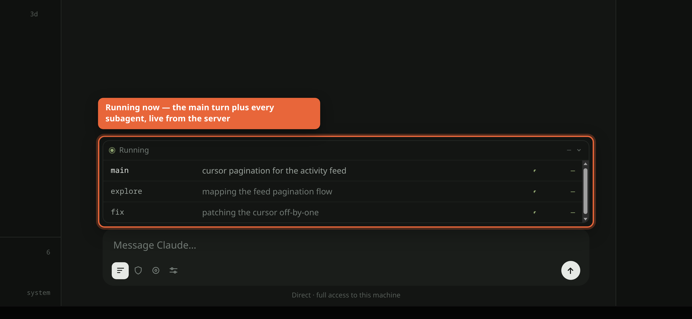

---
sources:
  - docs/prompts/WORKING_AGREEMENT.v2.md
  - docs/prompts/ROUTING.md
  - .claude/agents/worker.md
  - scripts/dispatch.mjs
---
# Orchestration & dispatch

Orchard is run by an **orchestrator** session that coordinates work but does not
edit files itself. It classifies each piece of work, dispatches it to a subagent
(or another provider), and keeps only a lean, durable overview. This page is the
map; deeper verification mechanics live in [verification.md](./verification.md).


*The running-agents strip — the orchestrator's main turn plus every dispatched
subagent, each row vouched for live by the server (synthetic data).*

## The orchestrator-does-not-implement model

The main session's value is a lean, durable overview — not holding every detail.
So **even a trivial one-line fix is dispatched to a subagent**, never edited
inline (traceability + context stays lean). The orchestrator relays
findings/summaries and lets each agent own its detail.

- Serialize agents that touch the **same file**; parallelize across **disjoint** files.
- Pick the model by **cost-of-mistake, not price** — default *up*, not down.

Source: `docs/prompts/WORKING_AGREEMENT.v2.md` §I; `docs/prompts/ROUTING.md`.

```mermaid
flowchart LR
    A[User request] --> B{Orchestrator<br/>classifies}
    B --> C[Dispatch worker(s)]
    C --> D[verify<br/>clean-room, cross-provider]
    D --> E[Commit<br/>explicit file list]
```

## Dispatch classes — pick exactly one, name it in the charter

Classify **before** writing the charter and record the class in it, so a later
pass can audit drift. (WA §I class table.)

| Class | One-line test for choosing it |
|---|---|
| `trivial` | You already know the exact edit and it fits in one line. (Still dispatched.) |
| `fix` | You can name the CAUSE and the blast radius in one sentence each. |
| `explore` | You can't name the cause, or >1 defensible approach → agent returns 2–3 approaches + a recommendation and **builds nothing**. |
| `plan+review` | High cost-of-mistake → `explore` first, then an INDEPENDENT agent critiques the PLAN before any build. Cross-provider by default. |
| `arch` | It's the Nth bug in one class → ARCH-### ticket, invariant first, no build until a human picks an option. |
| `verify` | Not an alternative — the REQUIRED second step after a `fix`/`plan+review`/`arch` build: a clean-room agent tries to BREAK the claim. |

**Default UP when torn:** an `explore` that concludes "the obvious fix was right"
costs one agent; a `fix` built on a wrong framing costs the whole chain.

`verify` is required for `fix`, `plan+review`, and `arch`; NOT required for
`trivial` or docs-only work. The verifier must be a **separate agent process**
(via the dispatch CLI), not an in-process subagent — see verification.md.

## Agent types & the model-tier rule

- **`worker`** (`.claude/agents/worker.md`) — the default fix/verify/feature
  worker for dispatched lanes. **Pinned to Opus 4.8.**
- **Model tier:** Opus 4.8 is the default for agents. Escalate to **Fable / Opus 5
  only for truly complex** (deep / adversarial / architecture / frontier-hard)
  problems, via an explicitly different agent type — not by re-pinning `worker`.
- **Cross-provider (codex / GPT):** a Claude orchestrator's in-process subagents
  are always Claude. To get **decorrelated** blind spots — plan review,
  adversarial review of finished work, a second opinion — route the whole task to
  the other provider through the dispatch runner. Spend the scarce GPT window on
  decorrelation, not bulk volume (that goes to the abundant Claude ladder).

Source: `.claude/agents/worker.md`; `docs/prompts/ROUTING.md`.

## The dispatch runner — `scripts/dispatch.mjs`

A one-shot, provider-routed task runner. A Claude session invokes it via Bash to
drive **one ORCHARD-level task** through another provider and consume the result.

```
npm run dispatch -- --provider openai    [--model <m>] [--sandbox workspace-write] "task"
npm run dispatch -- --provider anthropic [--model opus] "task"
```

- **Contract:** stdout = final result text only; stderr = progress (thread id,
  streamed deltas, tool activity); nonzero exit names a failure taxonomy kind.
- **Safe default:** `--sandbox read-only` (no writes); opt into
  `--sandbox workspace-write` when the task must edit files.
- `--provider openai` drives the real Codex runtime under an OS-level sandbox;
  `--provider anthropic` delegates to `claude -p` under Claude's own permission
  gate (an application-level gate, not a kernel jail — documented in the script).
- Every run is recorded into Orchard history, so dispatches are auditable in the
  dashboard like any other session.

## Concurrency discipline (brief)

One **in-place writer per file** — serialize agents that touch the same file.
For simultaneous mutators of the **same file**, give each its own git **worktree**
so they don't race the shared index. Never `git add -A`/`git add .` while agents
hold uncommitted work; commit **explicit file lists**. Details in verification.md.
