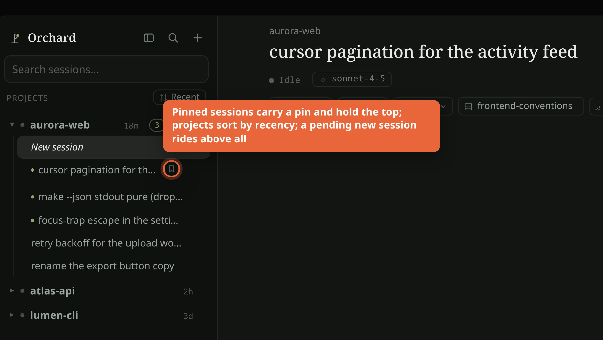
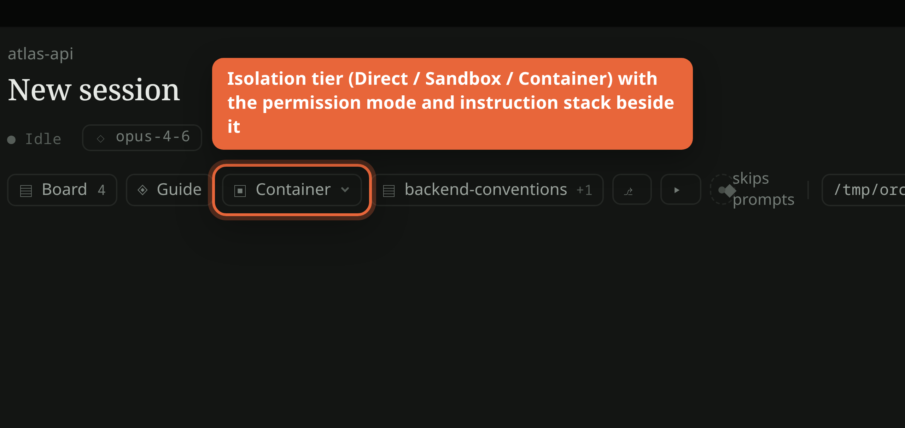
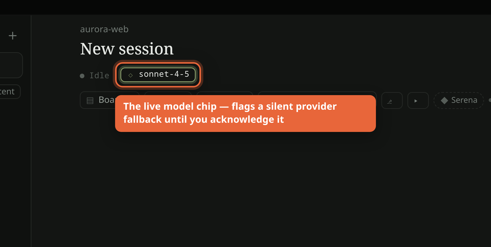

---
sources:
  - src/server/registry.ts
  - scripts/onboard.mjs
  - scripts/board.mjs
  - scripts/arch-watch.mjs
---
# Projects, sessions & isolation

A practical guide to what happens when you add a project to Orchard, how the
three isolation tiers differ, and how sessions behave across restarts.

*The project sidebar — projects sort by recency, pinned sessions carry a pin and
hold the top of their project, and a not-yet-sent "New session" rides above all
(synthetic data).*

*The isolation chip names the tier for this session (Direct / Sandbox /
Container); the permission-mode chip and the instruction stack sit beside it
(synthetic data).*

*The live model chip stays visible in the crown and flags a model change you did
not initiate (a silent provider fallback) until you acknowledge it (synthetic data).*

## Onboarding a new project

**Adding a project does NOT auto-apply the orchestration setup.** They are two
separate acts.

- **Adding a project** (the UI "add project", backed by `createProject()` in
  `src/server/registry.ts`) just records a registry row: a name, the host path,
  an isolation tier (defaults to `direct`), and default settings. It writes
  nothing into your repo — no board, no `CLAUDE.md`, no scripts. The registry
  itself lives outside the repo under `~/.local/share/claude-station/`.
- **Onboarding** (`npm run onboard <target-dir>`, i.e. `scripts/onboard.mjs`) is
  the deliberate, separate step that scaffolds the methodology into the repo.
  It is not run for you when you add a project — you invoke it yourself.

What `onboard` sets up (idempotent — it never clobbers an existing file, only
reports "exists"):

- **Board scaffold** — `docs/bugs/{README,INDEX,TEMPLATE,TEMPLATE-ARCH}.md`, the
  accumulating-context ticket board. Skip with `--no-board` for a scratch dir.
- **WA pointer** — a thin `docs/CLAUDE.md`-level `CLAUDE.md` pointing a bare
  `claude` session at the shared Working Agreement, plus a `docs/CONVENTIONS.md`
  stub for project-local rules (auto-injected alongside the WA for launched
  sessions). For a repo that already has its own `CLAUDE.md`, `--wa-pointer`
  appends a delimited pointer section instead of rewriting it.
- **Board drift-guard tools** — copies `scripts/board.mjs` and
  `scripts/arch-watch.mjs` into the target and wires `board:check` / `board:gen`
  / `arch:watch` into its `package.json` (copy, not a shared dependency, so the
  guard keeps working if Orchard later moves).
- **Deploy-context stub** — opt-in via `--deploy-context`: a
  `docs/DEPLOY-CONTEXT.md` the commit gatekeeper injects into reviewers so
  works-locally-breaks-prod mismatches are catchable.

Re-running is safe: existing artifacts are left byte-for-byte untouched;
`--force-board-tool` re-syncs just the copied tool scripts.

## Isolation tiers

Set per project (and overridable per session). Default is `direct`.

- **direct** — the session runs on the host, in the real project directory, with
  full machine access. This is the default and what most sessions use.
- **sandbox** (bubblewrap) — **modelled but not implemented.** Selecting it
  returns `501` rather than silently degrading to something weaker.
- **container** — a Docker container with **the real project tree bind-mounted**,
  plus memory and pid limits on by default. Important nuance: it isolates the
  rest of the machine, not the project itself — edits still land in your real
  files. Per-session **snapshots** are the undo for the project tree (reflink
  copies, near-instant, explicit restore only). Snapshots default ON for
  `container` and OFF elsewhere.

### Mounts (container only)

Extra host paths bind-mounted into the container (`Mount` = host path, container
path, read-only flag). Only meaningful when isolation is `container`. Mounting
`/var/run/docker.sock` is a separate, off-by-default, arm-then-confirm toggle:
on a rootful daemon it is equivalent to root on the host and voids every other
container limit.

### Permission modes (the security posture)

`default` / `plan` / `acceptEdits` / `bypassPermissions`. The default is
`default` (least privilege — risky tools route through the approval UI).
**`bypassPermissions` is never a global default** — it is an explicit per-project
or per-session opt-in. Outside a container the UI marks it as a raised risk and
spells out the consequence ("the model runs commands on this machine without
asking"); inside a container it is the calm container default, because there the
container, not the prompt, is the safety boundary.

## Sessions

### Survival across restarts

Sessions are built to outlive the server process, not just outlive turns
(FEAT-015 and the survival-broker work). The server can restart while a Claude
session keeps running: a live turn is **drained and re-adopted** instead of
killed, and a session's **background agents survive the restart** and run to
completion (BUG-044). Messages you send to a surviving session are still
delivered and produce normal replies (BUG-072). The conversation history is on
disk, so nothing structural is lost across a restart — at worst a session
continues by resume-from-disk rather than a live in-place follow-up.

Practical note this machinery earns: you should not need to time restarts around
live background work, and you should never kill a broker or a session process by
hand.

### Running-agents list

When a turn is executing, the running-process strip shows the live rows — the
main turn plus any background/subagent lanes it spawned, each with its own
activity. The invariant the survival fixes protect: no surface reports "nothing
running" while a turn is actually executing.

### Scratch sessions

The global **New session** button always lands in an Orchard-owned throwaway
project (`ensureScratchProject()`, id `scratch`), created on demand under a
scratch data dir. It is a completely ordinary project row — same settings shape,
same provider/model/permission defaults — so a quick throwaway question never
gets bound to whatever real project happened to be selected.

### Provider switching

Each project (and each session) has a provider: `anthropic` (Claude Code, the
default) or `openai` (Codex). Both bill against your existing subscription;
Orchard reads no API keys. Switching the provider for a session that has a model
or effort override armed for the other engine's catalog clears that override
(it named the wrong catalog) — repick from the model picker.

### The `/model` override

The model picker arms a per-session model/effort override. A **bare `/model`**
is treated as UI chrome — Orchard shows the picker rather than sending the CLI's
interactive picker into the transcript. **`/model <name>`** travels straight to
the CLI, which applies it. The header model chip shows the model the running
session actually reported; an armed override that the server has not yet
confirmed is shown as "applies on next launch", so you always see the real live
model rather than the one you hoped for.
