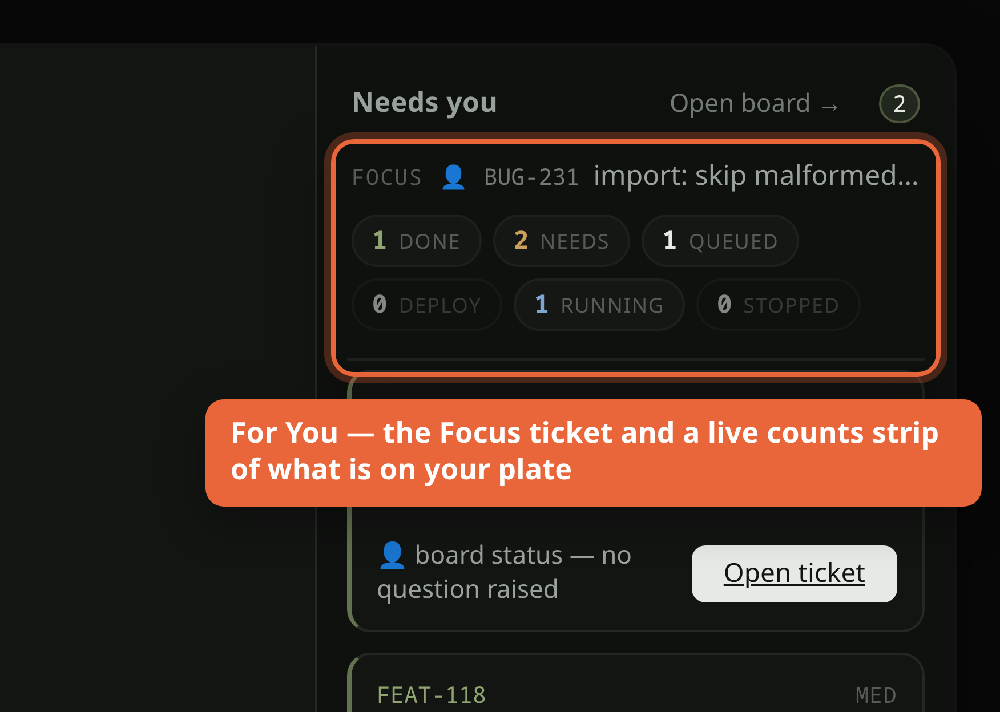
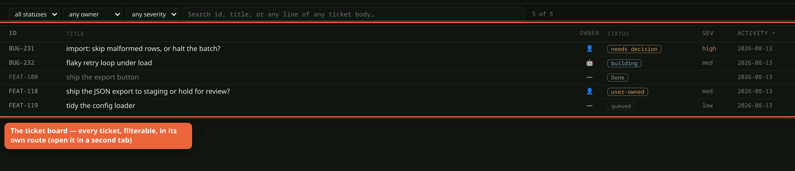
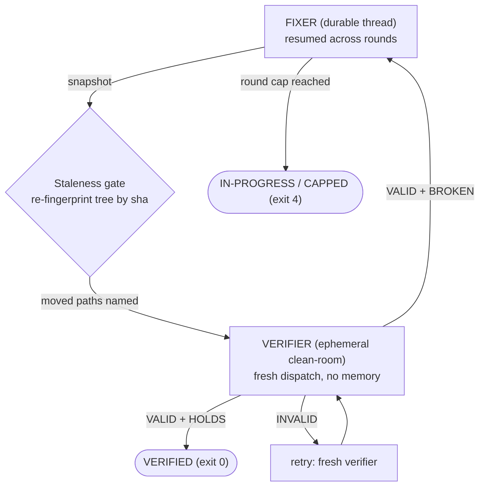

---
sources:
  - docs/prompts/WORKING_AGREEMENT.v2.md
  - scripts/independent-verify.mjs
  - scripts/lib/verdict-contract.mjs
  - scripts/verify-fix-loop.mjs
  - scripts/board.mjs
  - .claude/agents/worker.md
---
# Verification & the ticket flow

How Orchard keeps a fix honest: reproduce first, prove the flip, then let an
*independent* context try to break the claim before anything is committed. This
page is derived from the code that enforces it.

*The "For You" rail — the highest-priority ticket that needs a decision, plus a
live counts strip (done / needs / queued / running) of what is on your plate
(synthetic data).*

*The ticket board portal (`#/tickets`) — every ticket, filterable by status /
owner / severity, in its own route so you can read a ticket in one tab while the
orchestrator works in another (synthetic data).*

## The §C discipline — distrust your own green checkmark

Every fix follows the Working Agreement's §C
(`~/docs/prompts/WORKING_AGREEMENT.v2.md`, *"Make verification fail loudly"*):

- **Reproduce before you fix.** The test must **FAIL first** (a must-FAIL proof)
  so you know it exercises the real bug — a check whose success branch can fire
  on empty/missing input is worse than no test.
- **Prove the flip.** After the fix, the same test must go green — that transition
  (red -> green), not a bare PASS, is the evidence.
- **Print the observed value, not just PASS/FAIL** — a bare green can't be
  audited; assert the precondition before the check.
- **Honest counts + named anti-regressions.** Report real numbers (e.g. "138/138,
  +1 new ratchet") and name the prior suites you re-ran to show nothing regressed.
- **Generation must not verify itself.** The author of a fix cannot be its judge —
  same blind spots, same fixture, same conclusion.

That last rule is why the verifier is a *separate context* from the fixer.

## Is the verifier a distinct context from the bug solver? — Yes.

The verifier is a **clean-room, fresh-context agent**, structurally decorrelated
from whoever wrote the fix. This is not a prompt convention; it is enforced by
`~/scripts/independent-verify.mjs` and its contract
`~/scripts/lib/verdict-contract.mjs` (**FEAT-061**).

- **Not an in-process subagent.** A Task subagent inherits this session's
  instructions, board snapshot and framing — contaminated by construction.
  Verification goes out through `~/scripts/dispatch.mjs` as a **separate process,
  a fresh CLI, its own context**.
- **A clean room, not just a fresh prompt.** The tree is exported at the reviewed
  revision into a temp dir and the ambient-instruction surface (`CLAUDE.md`,
  `AGENTS.md`, `.claude/`, `docs/prompts/`, `docs/bugs/`) is **stripped** before
  the verifier starts — so it can't re-import the framing we're decorrelating
  from.
- **It never sees the fixer's prose.** Its whole input is: the requirement in
  plain terms, the diff, how to run things, and the fixer's **test code** (which
  it must re-run). The report, rationale and self-assessment — the prose that
  transmits the blind spot — are withheld.
- **Adversarial objective.** "Attempt to BREAK this claim," never "check this
  work" — double-check invites agreement.
- **VALID + executed-evidence, or it doesn't count.** The verdict must cite a
  `FIXER-TEST` run **and** at least one **adversarial case the fixer's fixture
  does not cover** (boundary / empty / second-page / concurrency /
  failure-injection), each with its own command and real output. Evidence is
  proven by **artifact existence**: a run recorder (`vrun.mjs`) executes each
  command and appends `{id, command, exit, output-sha256, timestamp}` to a
  **manifest outside the working copy**; `validateVerdict()` accepts a section
  only if it cites a recorded run whose id/exit/hash agree. No manifest entry ->
  UNTESTED, regardless of wording. A static-only or armchair review is
  mechanically **INVALID** (exit 3) — not a pass, not a fail.
- Cross-provider by default, so the fixer and verifier don't share blind spots.

### The verify -> fix loop (FEAT-062)

`~/scripts/verify-fix-loop.mjs` runs rounds with **deliberately different
lifetimes**: a durable fixer thread and a throwaway verifier each round.

- **Fixer = durable.** One resumed session so its explored dead ends aren't
  thrown away. **Verifier = ephemeral + clean-room every round** — persisting it
  would let it converge with the fixer, the exact failure this design prevents.
- **Staleness gate.** Just before every relay the tree is re-fingerprinted by its
  snapshot **tree sha**; if it moved, the relay opens by naming exactly the moved
  paths (intersected with the fixer's touched + verify-diff files) — never
  silent.
- **Round cap.** Unbounded verifier-chasing diverges, so there's a cap; an honest
  `IN-PROGRESS (CAPPED, exit 4)` is a designed outcome. INVALID verdicts are
  never relayed — the round is a verifier failure and retries fresh.
- Findings relay **verbatim** (harness-composed text, never a paraphrase, which
  would reintroduce framing). Neither script ever commits, pushes, or edits the
  repo — only the fixer dispatch writes.

## The ticket board (FEAT-068)

Real work is tracked in `~/docs/bugs/` — **append-only** tickets
(`BUG/FEAT/DEPLOY-NNN-*.md`, each read whole so fixes accumulate context) plus a
generated `INDEX.md` board. `~/scripts/board.mjs` reconciles the two: `check`
exits non-zero on drift, `gen` rewrites the board's tables from the tickets. The
tickets are the single source of truth — Title, Severity and **Status are derived
from each ticket's header on every `gen`** (a header that reaches FIXED / VERIFIED
/ DONE moves the row out of the Open table and into Done; a stale `👤` owner is
caught by `check`), while orchestrator-owned columns (Owner, the Done commit hash)
are preserved by id. This is the *self-correcting* board: a done ticket can no
longer leave a "still in progress" blurb drifting on the board indefinitely.

## 2026-08-13 workflow hardening

Two mechanical gates were tightened (source: `~/.claude/agents/worker.md` and the
concurrency lesson):

- **Realistic busy-state fixtures for UI.** Verifying the mechanism on a minimal
  fixture is not enough — the suite must include at least one **realistic-state
  fixture that mirrors real usage**. (Lesson: a sidebar cap fix passed 14/14 on a
  minimal fixture, then the user hit the bug immediately because a real busy day
  had many recent sessions the suite never modelled.) For a UI change, **drive the
  real click-path in a real headless browser over a busy-state fixture**, not just
  scripted DOM assertions on a clean one.
- **Hard concurrency pre-dispatch gate.** Before dispatching any in-place agent,
  ask: "is another live agent editing a file this one will touch?" Because
  `git commit` commits the whole index, concurrent in-place agents on one tree
  **race on the shared git index** (observed: an already-committed fix got
  staged-reverted by a racing lane). Rule: **one in-place writer per file** —
  if a file overlaps a live lane, either wait for it to commit or give the new
  agent `isolation:"worktree"`. When in doubt, serialize.
